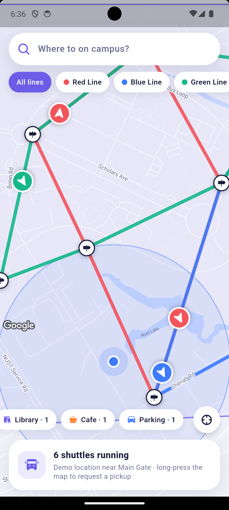
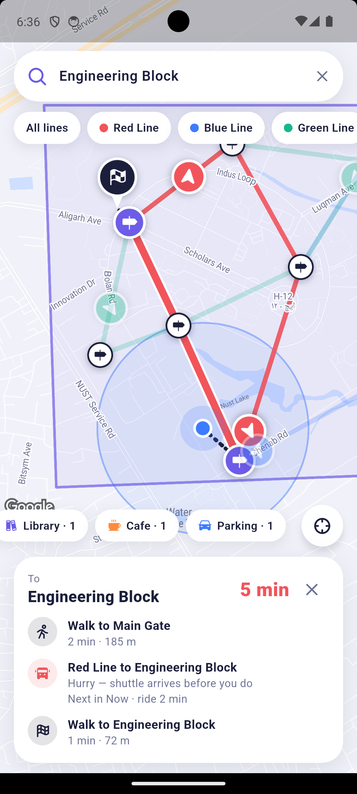
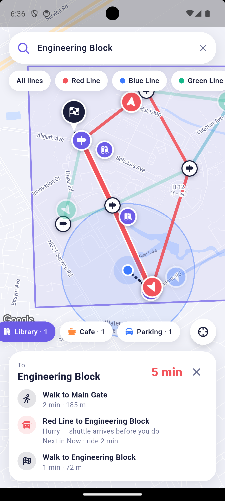
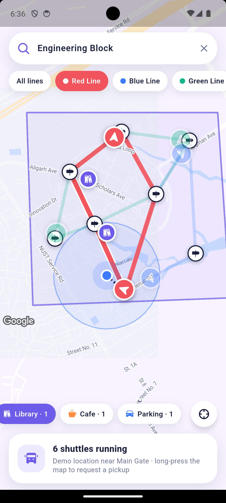
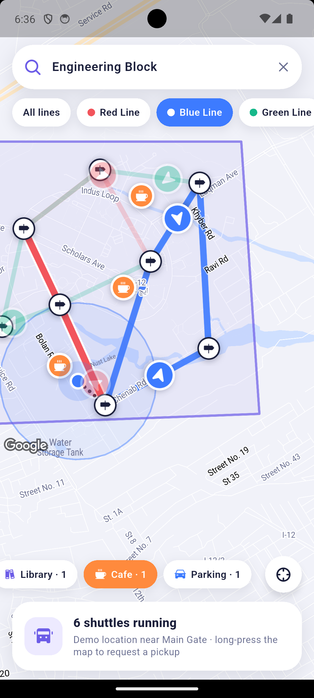
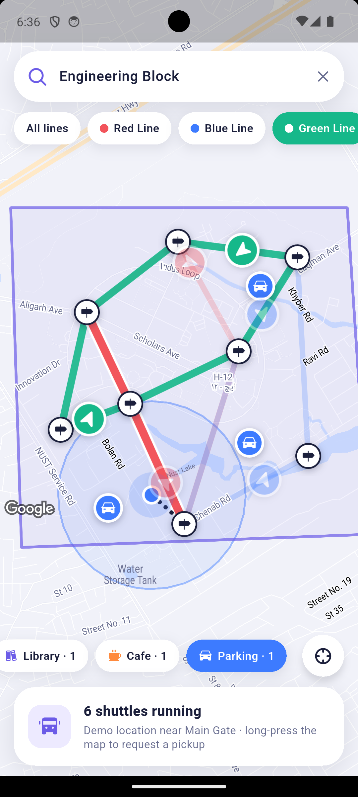

# CampusRide

A Flutter campus-mobility app built on Google Maps. It shows live (simulated) shuttle buses moving along colour-coded routes, plans trips between campus buildings, lets you request a pickup anywhere inside the campus geofence, and highlights nearby facilities.

> The campus, stops, and shuttles are **mock data** for a fictional campus near Islamabad, Pakistan. The shuttle positions come from an on-device simulator, not a real fleet feed.

## Screenshots

| Live shuttles on all lines | Trip planning | Trip with Library markers |
|:---:|:---:|:---:|
|  |  |  |
| 6 shuttles on three lines, with facility counts near you | Walk, ride, walk steps with an ETA | Facility chips toggle markers on the map |

| Red Line focus | Blue Line + Cafes | Green Line + Parking |
|:---:|:---:|:---:|
|  |  |  |
| Other lines fade out; campus geofence shown | Cafe markers and the Blue route | Parking markers and the Green route |

## Download the APK

Android users can install the app directly (about 48 MB):

**[Download CampusRide.apk](releases/CampusRide.apk)**

1. Copy the APK to your phone.
2. Open it and allow "Install unknown apps" when asked.
3. Grant location permission on first launch (optional; see below).

## Features

- **Live shuttle map** with three lines (Red, Blue, Green). Buses move along their routes and rotate to match their heading.
- **Line filter**: tap a line chip, or tap a route on the map, to focus it and dim the rest.
- **Trip planner**: search a campus building and the app picks the best line, the boarding and alighting stops, the walking legs, and an ETA.
- **Stop sheets**: tap any stop to see the next arrivals and plan a trip there.
- **Pickup request**: long-press anywhere on the map to drop a pickup pin. The pin turns a different colour outside the campus boundary. Confirm to see which shuttle is assigned and its ETA.
- **Facility filters**: toggle Library, Cafe, and Parking chips. Each chip shows how many are within 400 m of you.
- **Geofence**: the campus boundary is drawn as a polygon and checked with a point-in-polygon test.
- **Location handling**: uses your GPS when you are on campus. Otherwise it places you at a demo spot so the app is always usable.
- **Custom map style and markers**, drawn at runtime.

## Tech stack

| Area | Package |
|---|---|
| UI | Flutter (Material 3) |
| Maps | `google_maps_flutter` |
| Location | `geolocator` |
| Geocoding | `geocoding` |
| Backend | `firebase_core`, `cloud_firestore` |
| Icons | `phosphor_flutter` |

## Project structure

```
lib/
├── main.dart                  # Firebase init, app theme, entry point
├── firebase_options.dart      # Generated by FlutterFire CLI
├── pages/
│   ├── campus_page.dart       # Main CampusRide screen
│   ├── search_page.dart       # Earlier store-locator search screen (unused)
│   └── results_page.dart      # Earlier store-locator results (Firestore)
├── campus/
│   ├── campus_data.dart       # Stops, lines, buildings, facilities, boundary
│   ├── shuttle_simulator.dart # Moves shuttles along routes
│   ├── trip_planner.dart      # Picks line, stops, walking legs, ETA
│   ├── geo.dart               # Distance, bounds, point-in-polygon
│   ├── map_style.dart         # Custom Google Maps JSON style
│   └── marker_icons.dart      # Draws marker bitmaps at runtime
├── services/location_service.dart  # Permission and GPS handling
├── models/store.dart
├── theme/app_colors.dart
└── widgets/campus_widgets.dart     # Cards, chips, sheets
```

## How to implement it yourself

### 1. Prerequisites

- Flutter SDK 3.10 or newer (Dart `^3.10.1`). Check with `flutter --version`.
- Android Studio (Android) and/or Xcode 15+ with CocoaPods (iOS).
- A Google Cloud account and a Firebase account.

### 2. Get the code and dependencies

```bash
git clone <your-repo-url>
cd google_maps
flutter pub get
```

### 3. Create a Google Maps API key

1. Open the [Google Cloud Console](https://console.cloud.google.com/) and create or select a project.
2. Enable **Maps SDK for Android** and **Maps SDK for iOS**.
3. Go to **APIs & Services → Credentials → Create credentials → API key**.
4. Restrict the key to your app's package name / bundle ID and to the two Maps SDKs above.

> Keys live in gitignored files (see below). If a key was ever committed to a public repo, rotate it in the console and restrict the new one.

### 4. Add the key to Android

The manifest reads the key from a placeholder, so nothing secret is committed. Add it to `android/local.properties` (gitignored):

```properties
MAPS_API_KEY=YOUR_ANDROID_MAPS_KEY
```

[build.gradle.kts](android/app/build.gradle.kts) injects it into [AndroidManifest.xml](android/app/src/main/AndroidManifest.xml) as `${MAPS_API_KEY}`. The manifest also needs these permissions, which are already present:

```xml
<uses-permission android:name="android.permission.INTERNET"/>
<uses-permission android:name="android.permission.ACCESS_FINE_LOCATION"/>
<uses-permission android:name="android.permission.ACCESS_COARSE_LOCATION"/>
```

### 5. Add the key to iOS

Copy the example file and put your iOS key in it:

```bash
cp ios/Flutter/Secrets.xcconfig.example ios/Flutter/Secrets.xcconfig
# then edit GMS_API_KEY in ios/Flutter/Secrets.xcconfig (gitignored)
```

The key flows from `Secrets.xcconfig` into [Info.plist](ios/Runner/Info.plist) (`GMSApiKey`), and [AppDelegate.swift](ios/Runner/AppDelegate.swift) passes it to `GMSServices.provideAPIKey`. The location usage string is already in Info.plist.

Set the iOS deployment target to **15.0** (the Firebase SDK requires it):

- `ios/Podfile`: `platform :ios, '15.0'`
- Xcode → Runner target → *Minimum Deployments* → iOS 15.0

### 6. Connect Firebase

```bash
dart pub global activate flutterfire_cli
flutterfire configure
```

This creates `lib/firebase_options.dart`, `android/app/google-services.json`, and `ios/Runner/GoogleService-Info.plist` for your own Firebase project. Then, in the Firebase console, create a **Cloud Firestore** database. The campus screen uses mock data, so Firestore is only needed by the earlier store-locator pages (`search_page.dart`, `results_page.dart`), which read a `stores` collection:

```
stores/{id} → { name: String, category: String, location: GeoPoint }
```

### 7. Run

```bash
flutter run
```

For iOS the first run does a `pod install`. If it fails, run:

```bash
cd ios && pod install --repo-update && cd ..
```

### 8. Try it

| Do this | To see this |
|---|---|
| Wait a few seconds | Shuttles move along their lines |
| Tap a line chip | That line is highlighted, others fade |
| Type "Library" in the search bar | A planned trip with board and alight stops and an ETA |
| Tap a stop marker | Next arrivals for that stop |
| Long-press on the map | A pickup pin, then **Confirm** to see the assigned shuttle |
| Tap Library / Cafe / Parking | Facility markers and nearby counts |

The map starts at the campus (33.6430, 72.9900). If you are not on campus, your position is simulated at the main gate area, so every feature works from anywhere.

### 9. Build the APK

```bash
flutter build apk --release
```

The file is written to `build/app/outputs/flutter-apk/app-release.apk`. Copy it to `releases/CampusRide.apk` (`cp build/app/outputs/flutter-apk/app-release.apk releases/CampusRide.apk`) to update the download link above. For a smaller per-architecture build, add `--split-per-abi`.

For a Play Store release, sign the app with your own keystore (see the [Flutter signing guide](https://docs.flutter.dev/deployment/android#signing-the-app)) and change the `applicationId` from `com.example.*`.

### 10. Update the screenshots

The images above live in `docs/screenshots/`. To replace one, save a new PNG with the same file name. Quick ways to capture them: `flutter screenshot`, the emulator's camera button, or `adb exec-out screencap -p > docs/screenshots/home.png`.

## Customising the campus

Everything campus-specific lives in [lib/campus/campus_data.dart](lib/campus/campus_data.dart):

- `center` and `boundary` define the map start point and the geofence.
- `stops`, `lines`, `buildings`, and `facilities` define what appears on the map.
- `demoUser` is the fallback position when GPS is unavailable or far from campus.

To use real data, replace these constants with reads from Firestore. The simulator in [lib/campus/shuttle_simulator.dart](lib/campus/shuttle_simulator.dart) can be swapped for a live position stream.

## Troubleshooting

| Problem | Fix |
|---|---|
| Blank grey map | The API key is missing, wrong, or the Maps SDK is not enabled. Check `adb logcat` for "Authorization failure". |
| iOS: `cloud_firestore` needs a higher deployment target | Set the iOS platform to 15.0 as in step 5, then `pod install`. |
| Location never updates | Enable location on the device and grant permission. On an emulator, set a location in its extended controls. |
| Address shows coordinates only | Emulators often have no geocoder. This is expected, and real devices show street names. |

## Licence

Add a licence of your choice before publishing.
